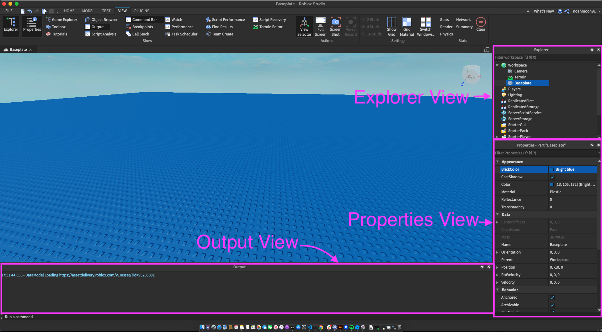

# Roblox Introduction

## Objective

To be able to setup your environment.

## Setup Environment Setup

1. Click on the New + and then click on base plate
2. Exit out of everything on the left side of your screen
2. Go to the View Tab
3. Make sure the explorer view is turned on.
4. Make sure the properties view is turned on.
5. Make sure the output view is turn on.

## Layout

- The explorer view is used to see all the parts of your game
- The properties view is used properties of an object or part in your game.
- The output view is used to so messages and errors in your game

